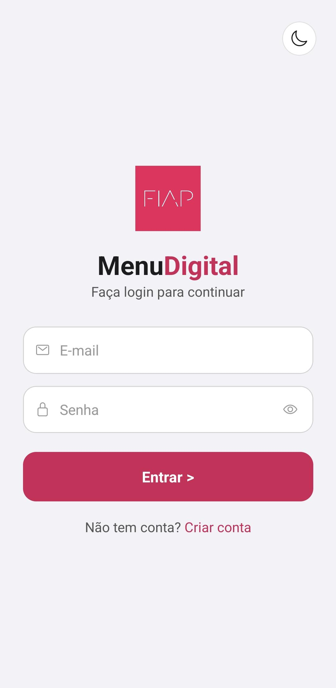
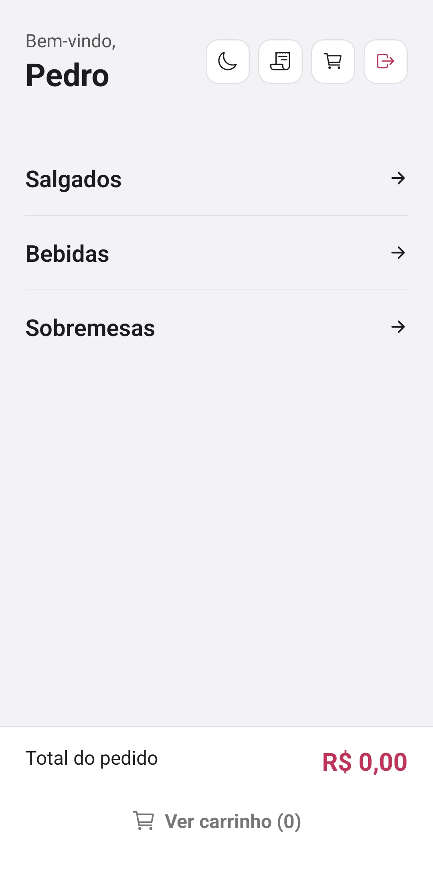
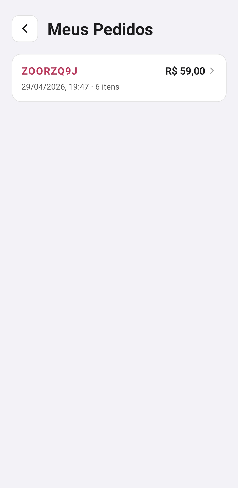
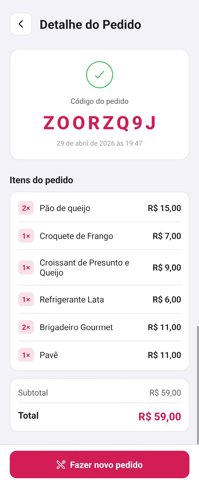

# 🍽️ FIAP Kitchen — Checkpoint 2

Aplicativo mobile desenvolvido em **React Native + Expo**, criado para modernizar a experiência da cantina da FIAP por meio de pedidos antecipados, autenticação de usuários, persistência local e uma interface refinada.

---

# 📱 Sobre o Projeto

## 💡 Problema que resolve
O **FIAP Kitchen** foi criado para solucionar um problema recorrente enfrentado por alunos da FIAP:

👉 **Filas longas, demora no atendimento e incerteza na cantina.**

Muitos estudantes possuem intervalos curtos entre aulas e precisam de uma solução prática para:
- Consultar produtos disponíveis
- Fazer pedidos com rapidez
- Reduzir tempo de espera
- Organizar melhor sua rotina

---

## 🎯 Operação FIAP escolhida
### 🍔 Cantina / Alimentação no campus

Escolhemos essa operação porque ela impacta diretamente a rotina acadêmica dos alunos, especialmente em horários de pico.

### 🚀 Nossa solução:
O app permite que o usuário:
- Faça cadastro e login seguro
- Monte pedidos antecipadamente
- Gerencie carrinho
- Realize pagamentos simulados
- Consulte histórico de compras
- Tenha seus dados persistidos mesmo após fechar o app

---

# 🆕 Evolução do CP1 para o CP2

## 🔥 Principais melhorias implementadas:
### No CP1:
- Login mockado
- Cardápio
- Carrinho
- Pagamento

### No CP2:
- 🔐 Sistema real de autenticação (Cadastro + Login)
- 💾 Persistência com AsyncStorage
- 🌐 Gerenciamento global com Context API
- 📧 Validação de e-mail exclusivo FIAP
- 🌙 Tema Dark/Light dinâmico
- 📜 Histórico de pagamentos
- 🚪 Logout com persistência de sessão
- 🛡️ Rotas protegidas para usuários autenticados
- 🎨 Interface visual aprimorada

---

# ⚙️ Funcionalidades Implementadas

## 🔐 Autenticação
- Cadastro com:
  - Nome completo
  - E-mail FIAP obrigatório (`@fiap.com.br`)
  - Senha (mín. 6 caracteres)
  - Confirmação de senha
- Login com validação
- Persistência de sessão
- Logout funcional

---

## 📋 Cardápio
- Salgados
- Bebidas
- Sobremesas

---

## 🛒 Carrinho
- Adição de produtos
- Remoção de produtos
- Quantidade dinâmica
- Total automático

---

## 💳 Pagamento
- Resumo do pedido
- Confirmação
- Persistência do pedido no histórico

---

## 📜 Histórico de Pedidos
- Lista de compras anteriores
- Detalhamento de cada pedido:
  - Itens
  - Quantidade
  - Valor total
  - Data

---

## 🌙 Diferencial Técnico Implementado (Obrigatório)
# Tema Dark/Light Dinâmico

### ✔️ Justificativa:
Escolhemos implementar o **Modo Escuro / Tema Dinâmico** porque ele melhora:
- Acessibilidade visual
- Personalização da experiência
- Usabilidade em ambientes com pouca luz

### 🛠️ Implementação:
- ThemeContext com Context API
- Alternância global entre temas
- Persistência da preferência do usuário com AsyncStorage

---

# 🧠 Decisões Técnicas

## 📂 Estrutura de Pastas

```bash
fiap-mdi-cp2-fiap-kitchen/
├── app/
│   ├── _layout.jsx
│   ├── bebidas.js
│   ├── cadastro.js
│   ├── cardapio.js
│   ├── carrinho.js
│   ├── carrinho.js
│   ├── codigoPedido.js
│   ├── detalhePedido.js
│   ├── historico.js
│   ├── index.js
│   ├── pagamento.js
│   ├── salgados.js
│   └── sobremesas.js
│
├── context/
│   ├── AuthContext.js
│   ├── CarrinhoContext.js
│   └── ThemeContext.js
│
├── constants/
│   └── colors.js
│
├── data/
│   ├── bebidas.js
│   ├── salgados.js
│   └── sobremesas.js
│
└── assets/
```

## 🎥 Demonstração

### Telas Login




### Tela Cardapio




### Telas Produtos


### Telas Carrinho


### Telas Pagamento


### Tela Pedido Confirmado


### Tela Histórico de Pedidos



### Tela Detalhes do Pedido



### Vídeo Demonstrativo


---