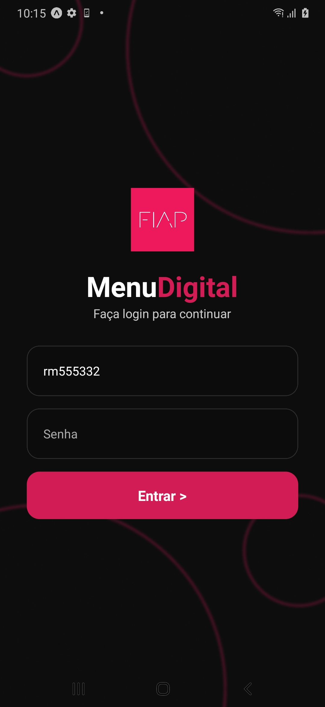
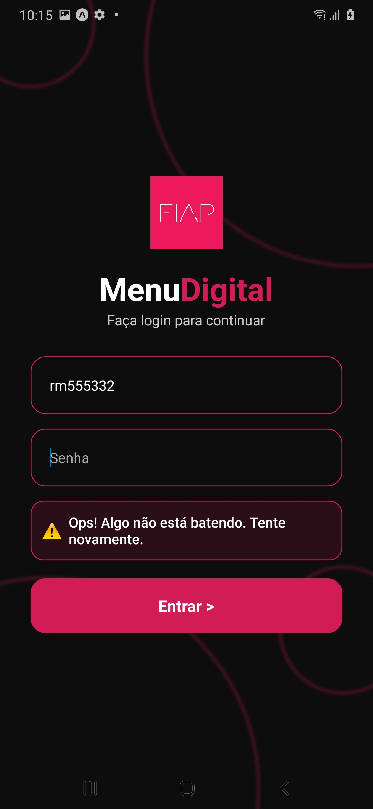
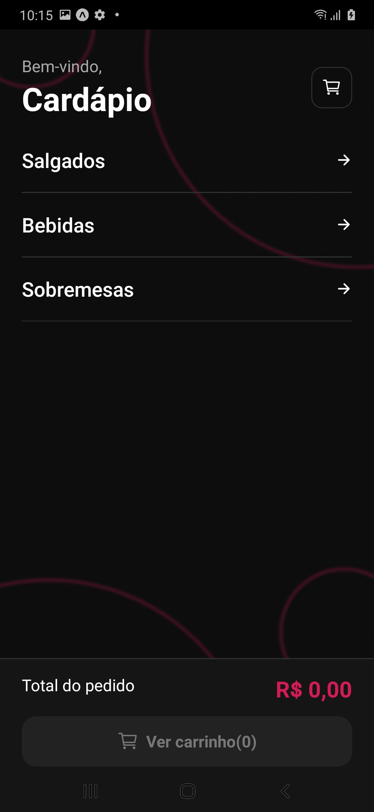
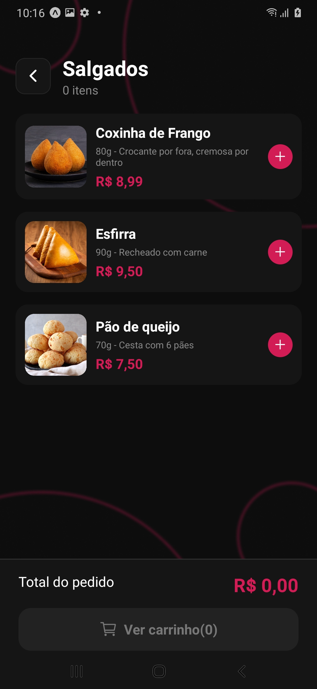
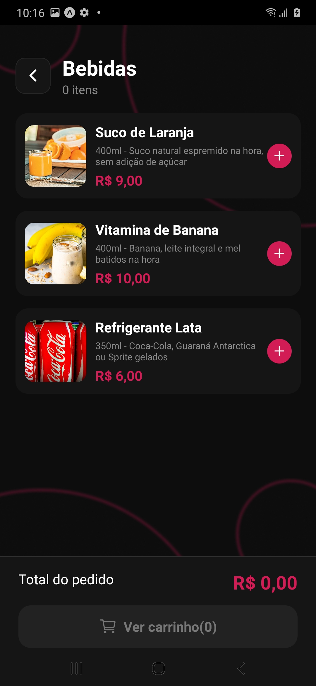
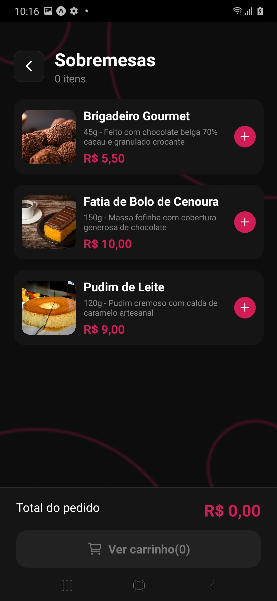
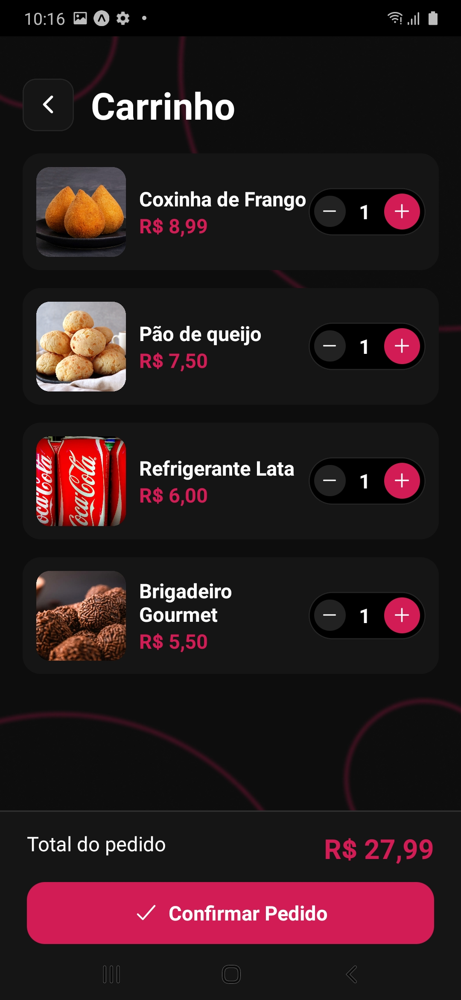
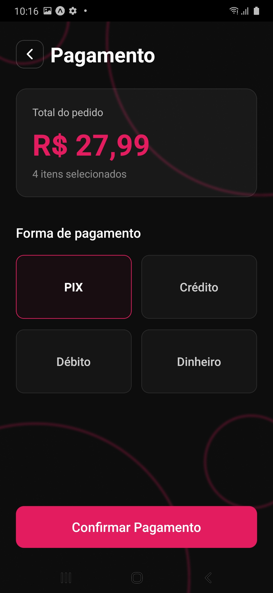
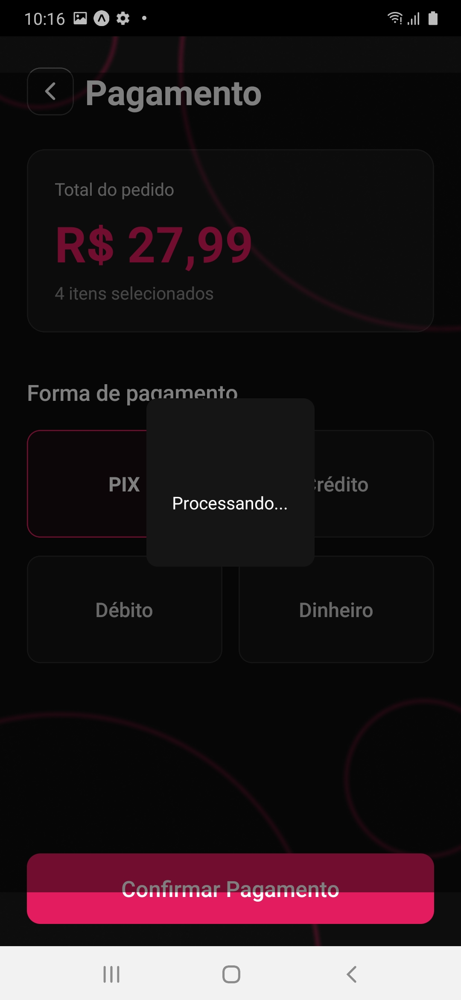

# 🍽️ FIAP Kitchen

Aplicativo mobile desenvolvido em React Native com Expo, com foco em simular um sistema de pedidos de uma cozinha/lanchonete.

---

## 📱 Sobre o projeto

### 💡 Problema que resolve

O **FIAP Kitchen** foi desenvolvido para solucionar um problema comum enfrentado pelos alunos da FIAP:
👉 **filas longas e incerteza no atendimento da cantina.**

Muitos estudantes têm pouco tempo entre as aulas e acabam enfrentando filas demoradas sem saber quanto tempo irão esperar ou se ainda há produtos disponíveis.

### 🎯 Operação escolhida

A operação escolhida foi:

👉 **Fila e incerteza na cantina**

#### ❓ Por quê?

Esse problema impacta diretamente:
- A rotina dos alunos
- O tempo disponível para alimentação
- A organização da cantina

O aplicativo propõe uma solução digital simples:

➡️ Permitir que o usuário monte seu pedido antecipadamente

➡️ Reduzir tempo de espera

➡️ Melhorar a experiência geral

---

## ⚙️ Funcionalidades implementadas
- 🔐 Tela de login simples
- 📋 Visualização do cardápio dividido em categorias:
    - Salgados
    - Bebidas
    - Sobremesas
- ➕ Adição e remoção de itens no carrinho
- 🛒 Tela de carrinho com:
    - Quantidade de itens
    - Valor total
- 📦 Confirmação de pedido
- 🔄 Atualização dinâmica do carrinho

---

## 📂 Estrutura do projeto

```
app/
 ├── _layout.js        # Layout e providers
 ├── index.js          # Tela de login
 ├── cardapio.js       # Menu principal
 ├── salgados.js       # Lista de salgados
 ├── bebidas.js        # Lista de bebidas
 ├── sobremesas.js     # Lista de sobremesas
 ├── carrinho.js       # Tela do carrinho
 ├── codigoPedido.js   # Tela do código do pedido
 └── pagamento.js      # Tela de pagamento

context/
 └── CarrinhoContext.js # Gerenciamento global do carrinho

data/                 # Armazenameto dos dados dos produtos
 ├── salgados.js
 ├── bebidas.js
 └── sobremesas.js
```

### ⚛️ Hooks utilizados

- ```useState```: Controle de estado (login, carrinho, quantidades)
- ```useContext```: Compartilhamento global do carrinho

---

## 🧠 Funcionalidades principais

### 🔐 Login

* Autenticação simples (mock)
* Redirecionamento para o cardápio após login

> Para acessar o sistema, utilize:
> ```bash
> Usuário: rm555332
> Senha: 123456
> ```

### 📋 Cardápio

* Exibição de categorias:

  * Salgados
  * Bebidas
  * Sobremesas

### 🛒 Carrinho

* Adicionar itens
* Remover itens
* Controle de quantidade
* Cálculo automático de:

  * Total de itens
  * Valor total

### 📦 Resumo do pedido

* Listagem dos produtos selecionados
* Valor total
* Confirmação do pedido

---

## ⚙️ Como rodar o projeto

### 🧰 Pré-requisitos

Antes de começar, você precisa ter instalado:
- Node.js
- npm ou yarn
- Expo CLI
- Aplicativo Expo Go (no celular)
ou emulador Android/iOS

### 1. Clonar o repositório

```bash
git clone https://github.com/jaoAprendiz/fiap-mdi-cp1-fiap-kitchen.git
cd fiap-mdi-cp1-fiap-kitchen/
```

### 2. Instalar dependências

```bash
npm install
```

### 3. Rodar o projeto

```bash
npx expo start
```

---

## 🎥 Demonstração

### Telas Login




### Tela Cardapio



### Telas Produtos





### Telas Carrinho




### Telas Pagamento




### Tela Pedido Confirmado


### Vídeo Demonstrativo

https://github.com/user-attachments/assets/32cbb07e-9842-4935-b68d-f5203309ee52

---

## 📌 Melhorias futuras

* Persistência do carrinho (AsyncStorage)
* Integração com backend
* Sistema de autenticação real
* Melhorias de UI/UX
* Refatoração com TypeScript

---

## 👨‍💻 Autores
- Maria Alice Freitas Araújo (RM557516)
- Pedro Henrique Mendes dos Santos (RM555332)
- João Victor Soave - RM557595
- Vinícius Fernandes Tavares Bittencourt (RM558909)
- Rafael Teofilo Lucena (RM555600)
> Desenvolvido para fins acadêmicos (FIAP).

---

## 📄 Licença

Este projeto é apenas para fins educacionais.
